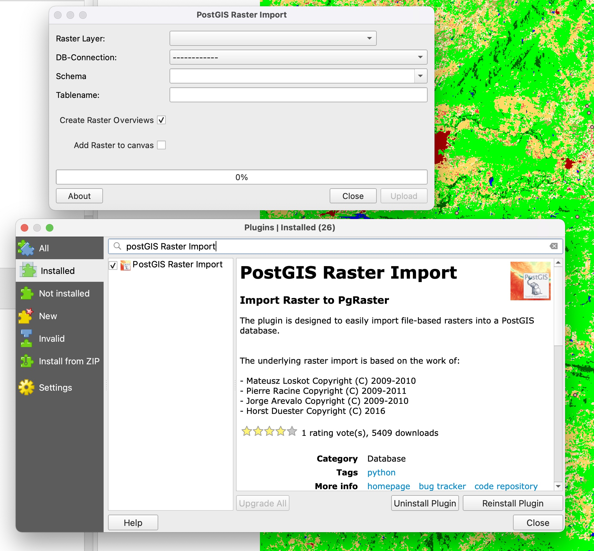
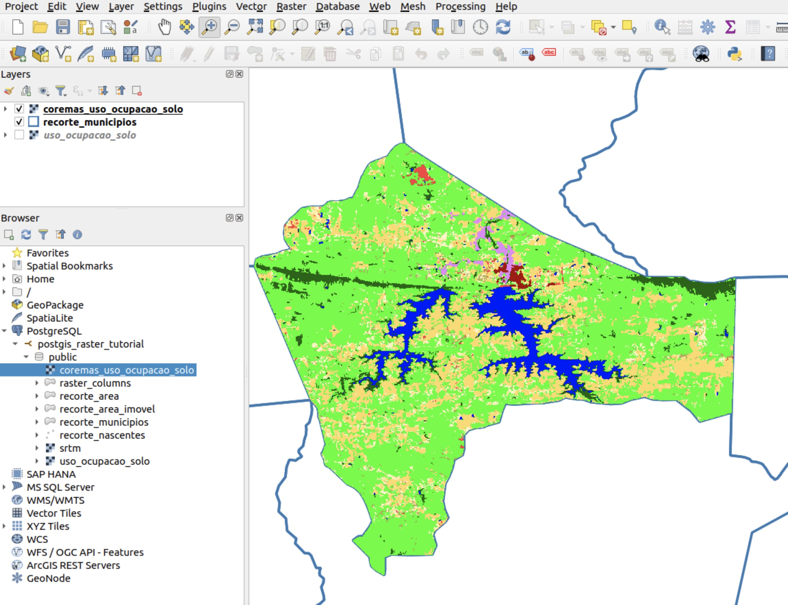
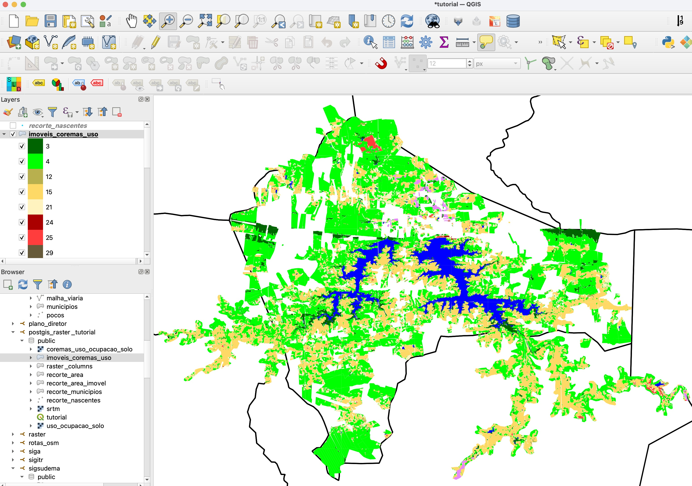

# PostGIS Raster

### Aula sobre a Extensão PostGIS Raster

A extensão PostGIS Raster possibilita o armazenamento e manipulação de dados matriciais em Banco de Dados Espaciais através da linguagem SQL.

Referência: https://postgis.net/docs/RT_reference.html


----------
## 1. Extensões Necessárias

Primeiro é necessário carregar as extensões do PostGIS e do PostGIS Raster no BD que você está trabalhando:


```sql
CREATE EXTENSION postgis;
CREATE EXTENSION postgis_raster;
```


## 2. Importação dos Dados

### 2.1 Através de linha de comando, exemplo:

```shell
╰─▶  raster2pgsql -s 4326 -I -M -C recorte_srtm.tif -F -t 90x90 > recorte_srtm.sql
```

Onde: 

* -s : sistema de referência espacial do raster (SRID 4326)
* -I: cria um índice GiST na coluna do raster
* -M: adiciona um "Vacuum analise" ao script
* -C: cria as constraints da tabela raster
* -F: adiciona uma coluna com o nome do arquivo
* -t 90×90: resolução espacial do raster

Fonte: http://postgis.net/docs/using_raster_dataman.html#RT_Loading_Rasters


### 2.2 Através do Plugin **PostGIS Raster Import**




## 3. Dados Utilizados

Iremos importar para o banco de dados **postgis_raster_tutorial**, os seguintes dados:

* Imagem de uso e ocupação do solo -  MAPBIOMAS (tabela **uso_ocupacao_solo**)
* Imagem SRTM - Embrapa (tabela **srtm**)
* Imóveis Rurais - CAR (tabela **recorte_area_imovel**)
* Nascentes - CAR (tabela **recorte_nascentes**)
* Limite dos Municípios - IBGE (tabela **recorte_municipios**)


## 4. Analizando as tabelas Raster:


```sql
SELECT (ST_MetaData(rast)).* FROM srtm LIMIT 1;
```

```
  upperleftx   |  upperlefty  | width | height |        scalex         |         scaley          | skewx | skewy | srid | numbands
---------------+--------------+-------+--------+-----------------------+-------------------------+-------+-------+------+----------
 -38.427916667 | -6.582083333 |    90 |     90 | 0.0002777777778108254 | -0.00027777777786088247 |     0 |     0 | 4326 |        1
(1 row)
```

https://postgis.net/docs/RT_ST_MetaData.html

```sql
SELECT (ST_BandMetaData(rast)).* FROM srtm LIMIT 1;
```

```
 pixeltype | nodatavalue | isoutdb | path | outdbbandnum | filesize | filetimestamp
-----------+-------------+---------+------+--------------+----------+---------------
 16BSI     |           0 | f       |      |              |          |
(1 row)
```

https://postgis.net/docs/RT_ST_BandMetaData.html


## 5. Análises entre dados vetoriais e Matriciais


### 5.1 Extração da altimetria das cinco nascentes mais altas:

```sql
SELECT
	n.gid AS id, 
	ST_Value(s.rast, n.geom) AS cota_m,
	n.geom
FROM srtm s, recorte_nascentes n 
WHERE ST_Intersects(n.geom, s.rast)
ORDER BY cota_m DESC LIMIT 5;
```

```
 id | cota_m |                        geom
----+--------+----------------------------------------------------
 67 |    609 | 0101000020E610000008EAAEEC7EF942C0C0B9A4CBC3851AC0
 15 |    508 | 0101000020E610000059C01E798AD942C01DF458E8F5111CC0
 14 |    483 | 0101000020E6100000DC3F092A94D942C0BAD847B802111CC0
 13 |    438 | 0101000020E6100000D5D4BC31ACDB42C056615DAB25101CC0
 66 |    432 | 0101000020E610000090F9437391F642C04097BCB31CA61AC0
(5 rows)
```

https://postgis.net/docs/RT_ST_Value.html


### 5.2 Recorte do uso e ocupação do solo em função do limite do município de Coremas:


```sql
-- Criação da Tabela:
CREATE TABLE coremas_uso_ocupacao_solo AS
SELECT st_clip(u.rast, m.geom) AS rast
FROM uso_ocupacao_solo u,
     recorte_municipios m
WHERE m.nome = 'Coremas';

-- Criação da Chave Primária:
ALTER TABLE coremas_uso_ocupacao_solo
    ADD COLUMN id serial PRIMARY KEY;

-- Criação do Índice Espacial:
CREATE INDEX idx_coremas_uso_ocupacao_solo_rast_gist ON coremas_uso_ocupacao_solo
    USING gist (st_convexhull(rast));

-- Registro da View de MetaDados raster_columns:
SELECT addrasterconstraints('coremas_uso_ocupacao_solo', 'rast', '4326');
```




### 5.3 Conversão do raster para vetor:

```sql
CREATE TABLE imoveis_coremas_uso AS
WITH clip AS (SELECT ST_Intersection(rast, geom) AS gv
              FROM recorte_area_imovel,
                   uso_ocupacao_solo
              WHERE ST_Intersects(rast, geom)
                AND recorte_area_imovel.municipio = 'Coremas')
SELECT ROW_NUMBER() OVER ()::integer AS id,
       (gv).val,
       (gv).geom
FROM clip
```



